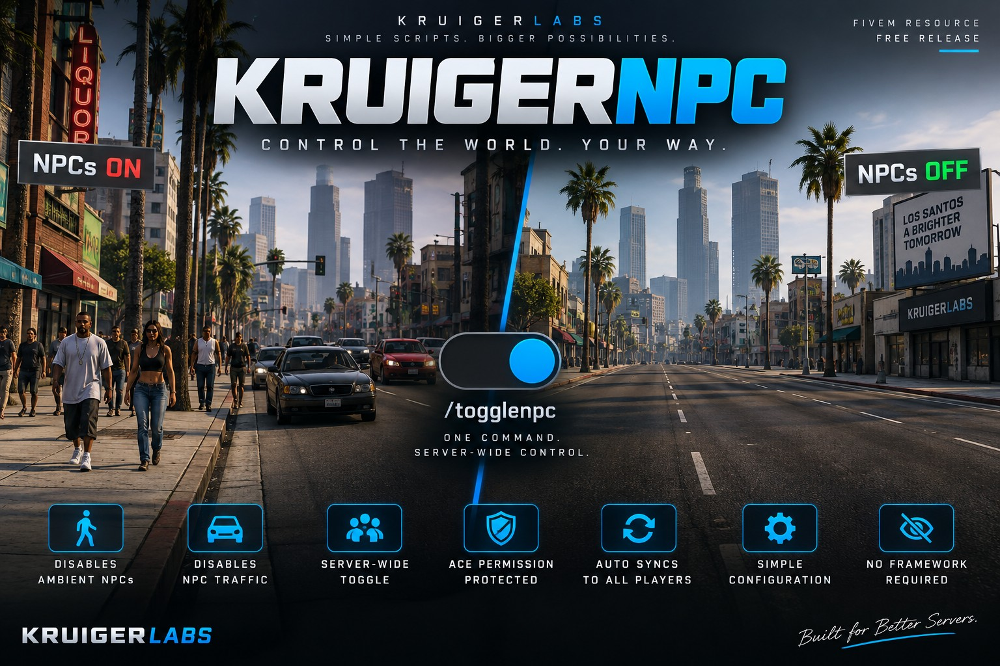

# KruigerNPC — Free FiveM NPC & Traffic Toggle Script

KruigerNPC is a **standalone FiveM NPC script** for enabling or disabling ambient pedestrians, NPC traffic, and parked vehicle density server-wide. The `/togglenpc` command is protected with standard FiveM ACE permissions.

## Features
- Server-wide `/togglenpc` command
- ACE permission protected
- Toggle ambient pedestrians and NPC-driven traffic
- Toggle parked ambient vehicle density
- Synchronized state for all players
- New players receive the current state automatically
- Does not delete player peds or player vehicles
- Standalone; no framework or dependencies required

## Installation
1. Place `KruigerNoNPC` in your resources folder.
2. Add `ensure KruigerNoNPC` to `server.cfg`.
3. Grant permission: `add_ace group.admin kruiger.npc.toggle allow`
4. Restart the server.

## Configuration
```lua
Config.Command = 'togglenpc'
Config.AcePermission = 'kruiger.npc.toggle'
Config.DefaultDisabled = true
```

## Documentation
- Full documentation: https://kruigerlabs.xyz/docs/free-scripts/kruigernpc
- FiveM scripts: https://kruigerlabs.xyz/fivem
- Documentation center: https://kruigerlabs.xyz/docs/
- FAQ: https://kruigerlabs.xyz/docs/faq

## Author
Kruiger Labs LLC (`KruigerLabs`)

## License
Licensed under the **Kruiger Labs Community License v1.0**. See `LICENSE` for complete terms.

## Kruiger Labs

**Project Page:** https://kruigerlabs.xyz/projects/KruigerNPC/
